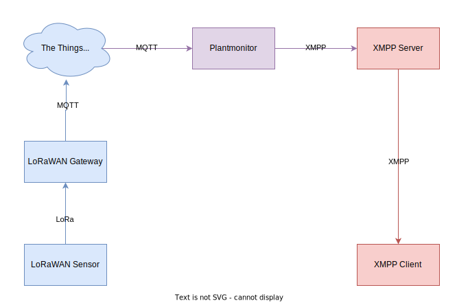

# Plantmonitor

_Backend for a LoRaWAN-based / MQTT-based soil moisture sensor, which sends notifications via XMPP._ 

Also see: [Blog post on thomas-leister.de [German]](https://thomas-leister.de/lorawan-plantmonitor/)

## Context

This project is meant to be used with the [`plantmonitor-sensor`](https://github.com/ThomasLeister/plantmonitor-sensor) software component (_"LoRaWAN Sensor"_). It will receive raw ADC sensor values from the TTN network MQTT broker and notify defined XMPP users when moisture thresholds are hit. 

## Features

Features of Plantmonitor:

* Receive sensor values via MQTT
* Convert raw values to normalized percentage values
* Quantify percentage values and assign a quantification level, such as "low moisture", "normal moisture" and "high moisture" level.
* Notify users via XMPP chat messages if moisture level is not "normal"
* Remind users if no action has been taken against non-normal levels for a certain period of time
* Notify users if no more sensor updates have been received 
* Respond to users via XMPP if they ask for the current status

_Chat messages can be defined via a language-specific config file. If a language is unsupported, yet, define your own chat message set!_

## Building Plantmonitor

Download source:

    git clone https://github.com/ThomasLeister/plantmonitor.git
    cd plantmonitor

Download module dependencies:

    go mod download

Run build script:

    ./build-release.sh

The `plantmonitor` binary will contain the application.

## Installing Plantmonitor

Starting as `root`user, take the following steps to install Plantmonitor manually:

Create a new user account on your system:

    adduser --disabled-login --disabled-password plantmonitor

Change to the new account:

    su - plantmonitor

Upload the `plantmonitor` binary, `config.example.yaml` and `lang_de.yaml` _(or any other language file)_ to `/home/plantmonitor/`.

Switch back to the root user:

    exit

and create a new Systemd service file at `/etc/systemd/system/plantmonitor.service` by copying the original file `dist/plantmonitor.service` from this repository. Make sure the paths in the service file are correct and enable the new service:

    systemctl daemon-reload
    systemctl enable plantmonitor.service

## Configuring Plantmonitor

Rename `config.example.yaml` to `config.yaml` and adapt the following settings:

* MQTT
* XMPP
* Giphy _(requires Giphy API key. Developer key is sufficient.)_

You can also change the level thresholds and more settings, but I'd suggest to leave that for later.

_Note: YAML configuration syntax is very picky with Tabs vs. Spaces! Use spaces only for identation!_

## Running Plantmonitor

You can now start Plantmonitor and check the logs:

    systemctl start plantmonitor
    journalctl -u plantmonitor -f

No errors should appear in the log. You can check the output by either waiting for sensor updates or sending the plant's XMPP account some messages, e.g. "help". 

In case you fine-tuned some settings regarding level thresholds (`config.yaml`) or chat messages (`lang_de.yaml`) there is not need to restart the full backend and lose all the sensor history. You can easily load the new values by running:

    systemctl reload plantmonitor

_(note: This will only affect chat messages and level definitions. The change of other settings such as MQTT and XMPP settings requirea full restart via `systemctl restart plantmonitor`)._

